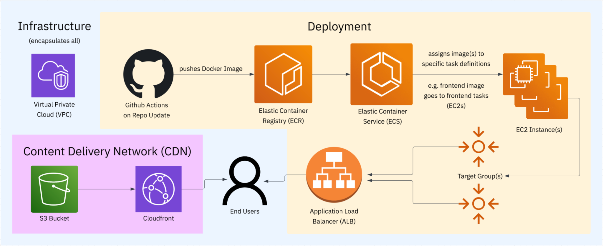

# Deployment

Avon will be deployed on AWS. We use a S3 bucket as the CDN and the compute runs on ECS.

Each part of the application (frontend, backend) are containerised separately. They register their presence with an ALB for the frontend and backend respectively. This means that we can easily scale the deployment to many containers, and the ALBs handle routing to one of the containers.

We plan to use a hosted PostgreSQL database on RDS. In order to deploy, the environment variables controlling the CDN path, CORS origins etc. should be properly set.

On Git pushes to main, GitHub will automatically build the Docker images and push them to ECR, before registering a new ECS task and applying it to the cluster. More information can be found in [CI/CD](../ci_cd).

